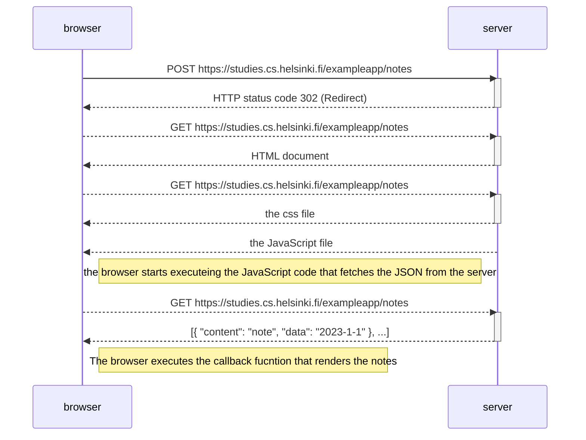

```mermaid
sequenceDiagram
participant browser
participant server

browser->>server: POST https://studies.cs.helsinki.fi/exampleapp/notes
activate server
server-->>browser: HTTP status code 302 (Redirect)
deactivate server

browser-->>server: GET https://studies.cs.helsinki.fi/exampleapp/notes
activate server
server-->>browser: HTML document
deactivate server

browser-->>server: GET https://studies.cs.helsinki.fi/exampleapp/notes
activate server
server-->>browser: the css file
deactivate server
server-->>browser: the JavaScript file

note right of browser: the browser starts executeing the JavaScript code that fetches the JSON from the server

browser-->>server: GET https://studies.cs.helsinki.fi/exampleapp/notes
activate server
server-->>browser: [{ "content": "note", "data": "2023-1-1" }, ...]
deactivate server

note right of browser: The browser executes the callback fucntion that renders the notes
```
